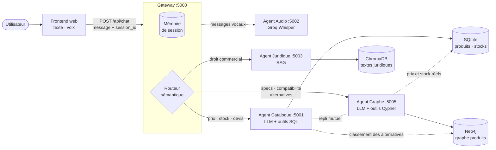
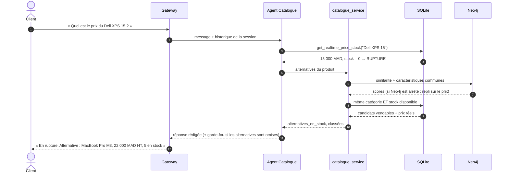
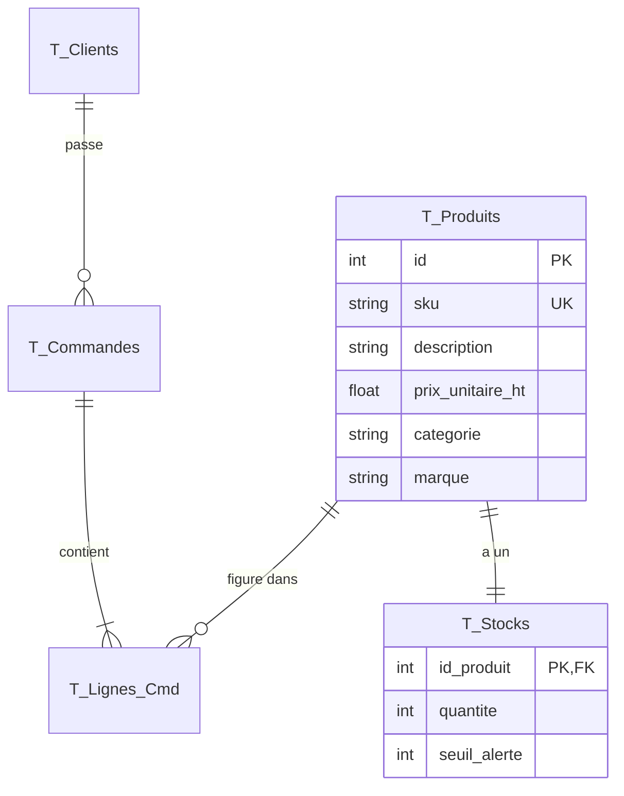
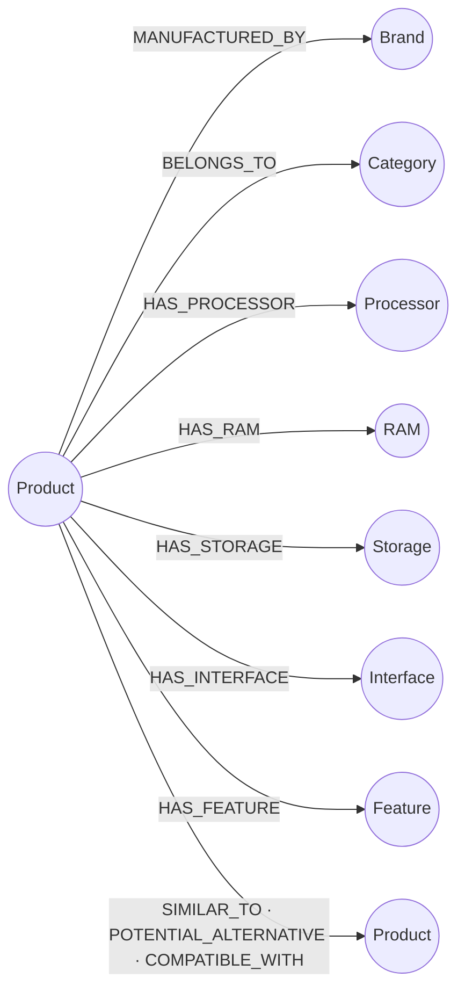
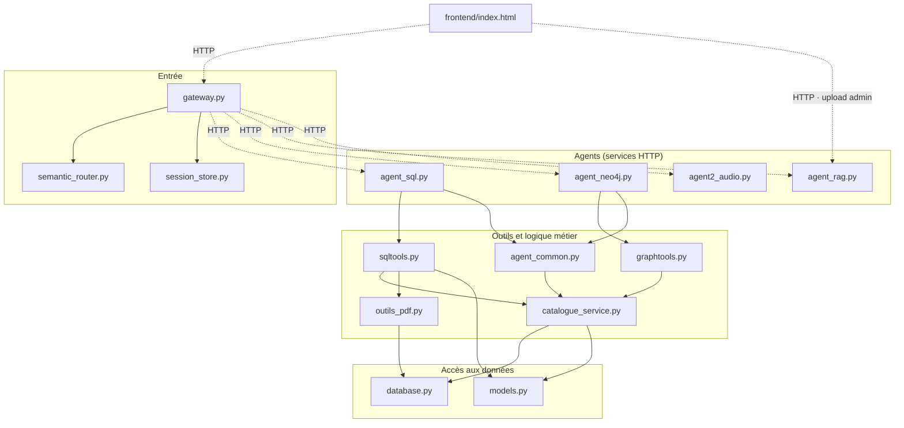

# Chatbot E-commerce Multi-Agents


Assistant conversationnel pour un magasin informatique en ligne. Il donne le **prix et le stock en temps réel**, propose des **alternatives réellement disponibles** quand un produit est en rupture, et répond aux questions **techniques** (caractéristiques, compatibilité) et **juridiques** (droit commercial marocain), à l'écrit comme à la voix.

Le système suit une architecture **multi-agents** : une passerelle unique reçoit chaque message et le confie à l'agent spécialisé compétent. Chaque agent s'appuie sur la source de données la plus adaptée : base relationnelle, graphe de connaissances ou base vectorielle.

**Fonctionnalités**

- 💰 Prix et stock en temps réel, recherche par budget, marque ou catégorie, alertes de stock, devis PDF
- 🔁 Produit en rupture → alternatives **en stock**, classées par similarité technique et proximité de prix
- 🧠 Questions techniques : caractéristiques, compatibilité, produits similaires (graphe Neo4j)
- ⚖️ Questions juridiques sur des documents déposés par l'administrateur (RAG)
- 💬 Mémoire de conversation : une question de suivi comme « et une alternative à celui-là ? » est comprise
- 🎤 Messages vocaux (transcription Whisper)

## Sommaire

1. [Démarrage rapide](#démarrage-rapide)
2. [Architecture](#architecture)
3. [Structure du projet](#structure-du-projet)
4. [Prérequis](#prérequis)
5. [Installation](#installation)
6. [Configuration](#configuration)
7. [Lancement](#lancement)
8. [Utilisation](#utilisation)
9. [API](#api)
10. [Dépannage](#dépannage)
11. [Stack technique](#stack-technique)

---

## Démarrage rapide

Windows (PowerShell), depuis la racine du projet. Chaque étape est détaillée dans [Lancement](#lancement), avec les commandes Linux / macOS.

```powershell
# 1. Environnement Python
python -m venv venv
.\venv\Scripts\Activate.ps1
pip install -r requirements.txt

# 2. Configuration : créer backend\.env (voir la section Configuration)

# 3. Neo4j dans Docker
docker pull neo4j:5.26
docker run -d --name neo4j-ecommerce -p 7474:7474 -p 7687:7687 -e NEO4J_AUTH=neo4j/votre_mot_de_passe -v "${PWD}/neo4j_data:/data" neo4j:5.26

# 4. Données (une fois Neo4j démarré : `docker logs neo4j-ecommerce` affiche « Started. »)
cd backend
python init_db.py
python build_rigorous_knowledge_graph.py
cd ..

# 5. Les 5 services, chacun dans sa propre fenêtre
foreach ($s in "agent_sql.py", "agent_neo4j.py", "agent_rag.py", "agent2_audio.py", "gateway.py") {
    Start-Process powershell -WorkingDirectory "$PWD\backend" -ArgumentList "-NoExit", "-Command", "..\venv\Scripts\python.exe $s"
}

# 6. Interface de chat
start frontend\index.html
```

---

## Architecture

### Vue d'ensemble



### Les services

| Service | Port | Fichier | Rôle | Données |
|---|---|---|---|---|
| **Gateway** | 5000 | `gateway.py` | Point d'entrée unique : gère les sessions, choisit l'agent, bascule vers un autre agent en cas d'échec | Mémoire de session (RAM) |
| **Agent Catalogue** | 5001 | `agent_sql.py` | Prix, stock, recherche par budget / marque / catégorie, alertes, devis PDF, alternatives en cas de rupture | SQLite (+ Neo4j pour classer les alternatives) |
| **Agent Audio** | 5002 | `agent2_audio.py` | Transforme un message vocal en texte | — |
| **Agent Juridique** | 5003 | `agent_rag.py` | Répond aux questions de droit commercial en citant les documents | ChromaDB |
| **Agent Graphe** | 5005 | `agent_neo4j.py` | Caractéristiques techniques, compatibilité, produits similaires, alternatives | Neo4j (+ SQLite pour les prix et stocks) |
| **Neo4j** | 7474 / 7687 | conteneur Docker | Graphe de connaissances des produits | `neo4j_data/` |

Les agents Catalogue et Graphe sont des **agents LLM à outils** : le modèle de langage choisit quel outil appeler (requête SQL, requête Cypher…), et ce sont les outils qui fournissent les chiffres. Un prix ou un stock affiché vient toujours de la base, jamais du modèle.

### Parcours d'un message

1. Le frontend envoie le message (ou l'enregistrement audio, transcrit par l'agent Audio) à la gateway, accompagné du `session_id`.
2. La gateway charge l'historique de la session.
3. Le **routeur** choisit l'agent en plusieurs passes, de la plus rapide à la plus coûteuse :
   - une salutation seule (« bonjour ») reçoit une réponse locale immédiate ;
   - des **mots-clés** par domaine (prix, stock, devis / alternative, RAM, compatible / loi, article…) : l'agent qui en compte le plus l'emporte ;
   - sinon, une **similarité d'embeddings** entre la question et la description de chaque agent, avec un seuil propre à chaque agent ;
   - si l'intention reste floue (« et celui-là ? »), l'agent du tour précédent est conservé.
4. L'agent interroge sa source de données via ses outils et rédige la réponse. Son statut (`success`, `error_code`) est calculé à partir des **retours de ses outils**, pas du texte du modèle.
5. En cas d'échec métier, la gateway **retente** auprès de l'agent voisin :

   | Agent d'origine | Repli vers | Déclenché par |
   |---|---|---|
   | Catalogue | Graphe | `PRODUCT_NOT_FOUND`, `NO_RESULT`, `EMPTY_RESPONSE` |
   | Graphe | Catalogue | les mêmes, plus `TOOL_ERROR` et `AGENT_ERROR` (ex. Neo4j arrêté) |

6. La gateway enregistre l'échange dans la session et renvoie la réponse.

### Rupture de stock et alternatives

Quand un produit est en rupture, ou que la quantité demandée dépasse le stock, l'outil de prix et de stock joint **lui-même** des alternatives à sa réponse. Le modèle de langage n'a pas besoin de penser à appeler un second outil.



| Règle | Décidée par | Détail |
|---|---|---|
| **Éligibilité** | SQLite | Même catégorie, et stock supérieur ou égal à la quantité voulue |
| **Classement** | Neo4j + SQLite | Score = 0,5 × similarité vectorielle + 0,3 × caractéristiques partagées + 0,2 × proximité de prix |
| **Mode dégradé** | — | Si Neo4j est indisponible, le classement se fait sur le seul prix (`source_classement: "catalogue_sql"`) |
| **Garde-fou** | `agent_common.py` | Si le modèle ne cite aucune des alternatives, leur liste est ajoutée à la réponse |

Les outils de recommandation de l'agent Graphe appliquent le même filtre : ils ne proposent jamais un produit en rupture.

### Mémoire de conversation

- La gateway crée un `session_id` au premier message et le renvoie. Le frontend le conserve pour la durée de l'onglet.
- La gateway garde les **6 derniers échanges** de chaque session (pendant **30 minutes** d'inactivité au plus) et les transmet à l'agent appelé dans le champ `history`. Les agents restent **sans état**. Une question de suivi fonctionne donc même si elle est confiée à un autre agent que la question précédente.
- Seules les réponses utiles sont mémorisées ; les erreurs techniques ne le sont pas.
- Le menu **+ → Nouvelle conversation** du frontend efface la session.

### Modèle de données

**SQLite**, la source de vérité pour les prix et les stocks :



**Neo4j**, le graphe de connaissances (sans prix ni stock) :



- Les caractéristiques (processeur, RAM, ports…) sont extraites des descriptions par le LLM lors de la construction du graphe.
- `SIMILAR_TO` relie les produits dont les descriptions sont très proches (similarité cosinus > 0,75). `POTENTIAL_ALTERNATIVE` relie les produits de même catégorie et de marques différentes. `COMPATIBLE_WITH` relie les produits qui partagent une interface (ex. USB-C).

**ChromaDB** stocke les documents juridiques, découpés en extraits (par article ou chapitre quand c'est possible) et vectorisés.

---

## Structure du projet

```text
.
├── README.md
├── requirements.txt                       Dépendances Python
├── .gitignore
│
├── frontend/
│   └── index.html                         Interface de chat : texte, voix, upload admin, nouvelle conversation
│
├── backend/
│   │
│   │   ── Entrée ─────────────────────────────────────────────
│   ├── gateway.py                         :5000  Point d'entrée unique : sessions, routage, repli
│   ├── semantic_router.py                        Choix de l'agent : salutation → mots-clés → embeddings
│   ├── session_store.py                          Mémoire de conversation par session (6 échanges, 30 min)
│   │
│   │   ── Agents (un service HTTP chacun) ────────────────────
│   ├── agent_sql.py                       :5001  Agent Catalogue : LLM + outils SQL
│   ├── agent_neo4j.py                     :5005  Agent Graphe : LLM + outils Cypher
│   ├── agent_rag.py                       :5003  Agent Juridique : RAG sur ChromaDB
│   ├── agent2_audio.py                    :5002  Agent Audio : transcription Groq Whisper
│   ├── agent_common.py                           Partagé par les agents LLM : historique, statut, garde-fou
│   │
│   │   ── Outils et logique métier ──────────────────────────
│   ├── sqltools.py                               Outils de l'agent Catalogue (prix, stock, budget, alertes, devis)
│   ├── graphtools.py                             Outils de l'agent Graphe (recherche, recommandation, compatibilité)
│   ├── catalogue_service.py                      Sans LLM : résolution des produits, alternatives en stock
│   ├── outils_pdf.py                             Génération des devis PDF
│   │
│   │   ── Données ───────────────────────────────────────────
│   ├── models.py                                 Tables SQLAlchemy : produits, stocks, clients, commandes
│   ├── database.py                               Connexion SQLite
│   ├── init_db.py                                Crée la base et les 10 produits de démonstration
│   ├── build_rigorous_knowledge_graph.py         Construit le graphe Neo4j à partir du catalogue
│   │
│   │   ── Générés en local (non versionnés) ─────────────────
│   ├── .env                                      Configuration (à créer)
│   ├── ecommerce.db                              Base SQLite (créée par init_db.py)
│   ├── chroma_store/                             Index vectoriel des documents juridiques
│   └── uploads/                                  Créé au démarrage de l'agent Juridique
│
├── outputs/                                      Devis PDF générés par l'agent Catalogue
└── neo4j_data/                                   Données de Neo4j (volume Docker, non versionné)
```

### Dépendances entre modules

Flèche pleine : import Python. Pointillés : appel HTTP.



`init_db.py` (qui utilise `database.py` et `models.py`) et `build_rigorous_knowledge_graph.py` sont des scripts autonomes, lancés à l'installation.

### Où modifier quoi ?

| Je veux… | Fichier(s) |
|---|---|
| Ajouter ou modifier un produit de démonstration | `init_db.py` **et** `build_rigorous_knowledge_graph.py`, puis [réinitialiser les données](#réinitialiser-les-données) |
| Ajouter un outil à l'agent Catalogue | `sqltools.py` (fonction `@tool` + liste `SQL_TOOLS`), et sa règle d'usage dans `SYSTEM_PROMPT` d'`agent_sql.py` |
| Ajouter un outil à l'agent Graphe | `graphtools.py` (liste `TOOLS_LIST`), et `SYSTEM_PROMPT` d'`agent_neo4j.py` |
| Ajuster le routage | `semantic_router.py` : `ROUTER_METADATA`, `SQL_KEYWORDS` / `NEO4J_KEYWORDS` / `LEGAL_KEYWORDS`, `THRESHOLDS` |
| Changer les règles de repli | `FALLBACK_RULES` dans `gateway.py` |
| Changer le classement des alternatives | `catalogue_service.py` : `POIDS_SIMILARITE`, `POIDS_SPECS`, `POIDS_PRIX` |
| Changer la durée de la mémoire | Variables `SESSION_MAX_TURNS` et `SESSION_TTL_SECONDS` |
| Changer de modèle LLM | `ChatGroq(model=...)` dans `agent_sql.py`, `agent_neo4j.py` et `agent_rag.py` |
| Modifier la mise en page du devis | `outils_pdf.py` |
| Ajouter un agent | Un nouveau service HTTP, puis `AGENT_ENDPOINTS`, `ROUTER_METADATA` et `THRESHOLDS` dans `semantic_router.py` |

---

## Prérequis

| Outil | Version | Utilisé pour |
|---|---|---|
| Python | **3.11 ou 3.12** | Tout le backend. Python 3.13 n'est pas pris en charge par `pydub` (agent Audio) sans le paquet `audioop-lts` |
| Docker Desktop | récent | Faire tourner Neo4j |
| Clé API Groq | — | LLM des agents, transcription audio, construction du graphe. À créer sur [console.groq.com/keys](https://console.groq.com/keys) |
| ffmpeg | dans le `PATH` | Conversion des messages vocaux. Windows : `winget install Gyan.FFmpeg` · macOS : `brew install ffmpeg` · Debian/Ubuntu : `sudo apt install ffmpeg` |
| Connexion Internet | installation et 1er lancement | Téléchargement des dépendances (dont PyTorch) et des modèles d'embedding |
| Espace disque | ~2 Go | Environnement Python (~1,3 Go) et modèles d'embedding (~650 Mo, dans le cache Hugging Face) |

---

## Installation

```powershell
git clone https://github.com/Styyde/MultiAgents-RAG-Ecommerce.git
cd MultiAgents-RAG-Ecommerce

python -m venv venv
.\venv\Scripts\Activate.ps1
pip install -r requirements.txt
```

> Si PowerShell refuse d'exécuter `Activate.ps1`, lancez une fois `Set-ExecutionPolicy -Scope CurrentUser RemoteSigned`, ou appelez directement `.\venv\Scripts\python.exe`.

<details>
<summary>Linux / macOS</summary>

```bash
git clone https://github.com/Styyde/MultiAgents-RAG-Ecommerce.git
cd MultiAgents-RAG-Ecommerce

python3 -m venv venv
source venv/bin/activate
pip install -r requirements.txt
```

</details>

---

## Configuration

Créer le fichier **`backend/.env`** (il n'est pas versionné) :

```env
# --- Obligatoire ---
GROQ_API_KEY=votre_cle_groq

# --- Neo4j : doit correspondre au conteneur Docker ---
NEO4J_URI=bolt://localhost:7687
NEO4J_USERNAME=neo4j
NEO4J_PASSWORD=votre_mot_de_passe

# --- Optionnel : valeurs par défaut ---
# SQL_AGENT_URL=http://localhost:5001/process
# NEO4J_AGENT_URL=http://localhost:5005/process
# LEGAL_AGENT_URL=http://localhost:5003/ask
# NEO4J_CONNECTION_TIMEOUT=5
# SESSION_MAX_TURNS=6
# SESSION_TTL_SECONDS=1800
```

| Variable | Obligatoire | Par défaut | Rôle |
|---|:---:|---|---|
| `GROQ_API_KEY` | ✅ | — | Accès aux modèles Groq (LLM et Whisper) |
| `NEO4J_PASSWORD` | ✅ | — | Mot de passe Neo4j, identique à celui de `NEO4J_AUTH` dans `docker run` |
| `NEO4J_URI` | | `bolt://localhost:7687` | Adresse de Neo4j |
| `NEO4J_USERNAME` | | `neo4j` | Utilisateur Neo4j |
| `SQL_AGENT_URL` | | `http://localhost:5001/process` | Adresse de l'agent Catalogue, utilisée par la gateway |
| `NEO4J_AGENT_URL` | | `http://localhost:5005/process` | Adresse de l'agent Graphe |
| `LEGAL_AGENT_URL` | | `http://localhost:5003/ask` | Adresse de l'agent Juridique |
| `DATABASE_URL` | | `backend/ecommerce.db` | Base relationnelle (URL SQLAlchemy) |
| `NEO4J_CONNECTION_TIMEOUT` | | `5` | Secondes d'attente avant de passer en mode dégradé si Neo4j ne répond pas |
| `SESSION_MAX_TURNS` | | `6` | Nombre d'échanges gardés en mémoire par session |
| `SESSION_TTL_SECONDS` | | `1800` | Durée de vie d'une session inactive, en secondes |

---

## Lancement

### 1. Démarrer Neo4j avec Docker

Docker Desktop doit être lancé. Depuis la racine du projet :

```powershell
# Télécharger l'image (une seule fois)
docker pull neo4j:5.26

# Créer et démarrer le conteneur (une seule fois)
docker run -d --name neo4j-ecommerce `
  -p 7474:7474 -p 7687:7687 `
  -e NEO4J_AUTH=neo4j/votre_mot_de_passe `
  -v "${PWD}/neo4j_data:/data" `
  neo4j:5.26

# Suivre le démarrage : attendre la ligne « Started. », puis Ctrl+C
docker logs -f neo4j-ecommerce
```

<details>
<summary>Linux / macOS</summary>

```bash
docker pull neo4j:5.26

docker run -d --name neo4j-ecommerce \
  -p 7474:7474 -p 7687:7687 \
  -e NEO4J_AUTH=neo4j/votre_mot_de_passe \
  -v "$(pwd)/neo4j_data:/data" \
  neo4j:5.26

docker logs -f neo4j-ecommerce
```

</details>

- L'interface d'administration de Neo4j est disponible sur http://localhost:7474 (utilisateur `neo4j`, votre mot de passe).
- Le mot de passe doit faire **au moins 8 caractères** et être identique à `NEO4J_PASSWORD` dans `backend/.env`.
- Les données du graphe sont écrites dans `neo4j_data/`. `NEO4J_AUTH` n'est lu qu'à la **première** création de ce dossier.
- Ensuite, `docker start neo4j-ecommerce` pour redémarrer, et `docker stop neo4j-ecommerce` pour arrêter.

### 2. Initialiser les données

```powershell
cd backend
python init_db.py                         # crée ecommerce.db avec les 10 produits de démonstration
python build_rigorous_knowledge_graph.py  # construit le graphe dans Neo4j
cd ..
```

- `init_db.py` n'ajoute les produits que si la base est vide.
- `build_rigorous_knowledge_graph.py` **efface puis reconstruit** tout le graphe. Il appelle le LLM une fois par produit pour en extraire les caractéristiques. Relancez-le après toute modification du catalogue.

### 3. Lancer les services

Chaque service tourne dans son propre terminal, avec l'environnement virtuel activé, depuis le dossier `backend/`. L'ordre n'a pas d'importance.

| Service | Commande | Vérification (une fois démarré) |
|---|---|---|
| Agent Catalogue | `python agent_sql.py` | http://localhost:5001/docs |
| Agent Graphe | `python agent_neo4j.py` | http://localhost:5005/docs |
| Agent Juridique | `python agent_rag.py` | http://localhost:5003/health |
| Agent Audio | `python agent2_audio.py` | http://localhost:5002/health |
| Gateway | `python gateway.py` | http://localhost:5000/admin/agents |

Sous Windows, cette commande ouvre les 5 services d'un coup, chacun dans sa fenêtre (à lancer depuis la racine du projet) :

```powershell
foreach ($s in "agent_sql.py", "agent_neo4j.py", "agent_rag.py", "agent2_audio.py", "gateway.py") {
    Start-Process powershell -WorkingDirectory "$PWD\backend" -ArgumentList "-NoExit", "-Command", "..\venv\Scripts\python.exe $s"
}
```

<details>
<summary>Linux / macOS : tout lancer en arrière-plan</summary>

```bash
cd backend
for s in agent_sql.py agent_neo4j.py agent_rag.py agent2_audio.py gateway.py; do
  ../venv/bin/python "$s" > "/tmp/${s%.py}.log" 2>&1 &
done
# Journaux : /tmp/agent_sql.log, /tmp/gateway.log, ...  Arrêt : kill $(jobs -p)
```

</details>

> Au premier lancement, les modèles d'embedding sont téléchargés une seule fois (celui du graphe dès l'étape 2, celui de la gateway et de l'agent Juridique au démarrage de ces services). Les démarrages suivants sont beaucoup plus rapides.

### 4. Ouvrir l'interface

Ouvrir `frontend/index.html` dans un navigateur (double-clic, ou `start frontend\index.html`).

Variante, si vous préférez servir la page en HTTP :

```powershell
python -m http.server 8080 --directory frontend   # puis http://localhost:8080
```

### 5. Vérifier depuis la ligne de commande

```powershell
Invoke-RestMethod http://localhost:5000/api/chat -Method Post -ContentType "application/json" `
  -Body '{"message": "Quel est le prix du MacBook Pro M3 ?"}'
```

<details>
<summary>Avec curl</summary>

```bash
curl -X POST http://localhost:5000/api/chat \
  -H "Content-Type: application/json" \
  -d '{"message": "Quel est le prix du MacBook Pro M3 ?"}'
```

</details>

### Arrêter

Fermer les fenêtres des services (ou `Ctrl+C` dans chacune), puis `docker stop neo4j-ecommerce`.

---

## Utilisation

### Scénario de démonstration : rupture de stock et mémoire

À enchaîner dans la même conversation :

| # | Message | Ce qui se passe |
|---|---|---|
| 1 | Le client a acheté 10 Dell XPS 15, mets à jour le stock. | L'agent Catalogue passe le stock du Dell XPS 15 de 10 à 0 |
| 2 | Quel est le prix du Dell XPS 15 ? | Rupture annoncée, avec une alternative en stock : le MacBook Pro M3 |
| 3 | Et combien coûte la première alternative ? En reste-t-il 3 ? | La mémoire permet de comprendre « la première alternative » : prix et stock du MacBook Pro M3 |
| 4 | Réceptionne 10 Dell XPS 15 en stock. | Le stock revient à 10 |

### Exemples de questions

| Question | Agent |
|---|---|
| Quel est le prix du MacBook Pro M3 ? | Catalogue |
| Quels ordinateurs ont un prix inférieur à 16000 MAD ? | Catalogue |
| Quels produits sont en rupture ou sous le seuil d'alerte ? | Catalogue |
| Fais-moi un devis pour 2 souris Logitech au nom de Jean Dupont | Catalogue (PDF dans `outputs/`) |
| Quels produits ont une interface USB-C ? | Graphe |
| Quels accessoires sont compatibles avec le MacBook Pro M3 ? | Graphe |
| Propose-moi une alternative à l'iPhone 15 Pro | Graphe |
| Selon la loi 15-95, qu'est-ce qu'un acte de commerce ? | Juridique (après le dépôt d'un document) |

### Catalogue de démonstration

| Produit | Catégorie | Prix HT (MAD) | Stock initial |
|---|---|---:|---:|
| PC Portable Dell XPS 15 | Ordinateur | 15 000 | 10 |
| MacBook Pro M3 | Ordinateur | 22 000 | 5 |
| iPhone 15 Pro | Smartphone | 13 000 | 8 |
| Samsung Galaxy S24 Ultra | Smartphone | 14 000 | 6 |
| Ecran Dell UltraSharp 27 | Ecran | 4 500 | 15 |
| Casque Sony WH-1000XM5 | Audio | 3 500 | 12 |
| Disque Dur Externe SSD 1To SanDisk | Stockage | 1 300 | 30 |
| Souris Sans Fil Logitech MX Master 3 | Accessoire | 1 200 | 50 |
| Clavier Mécanique Keychron K2 | Accessoire | 1 100 | 20 |
| Câble USB-C vers HDMI | Accessoire | 250 | 100 |

Le seuil d'alerte est de 5 unités pour tous les produits. Seules les catégories Ordinateur, Smartphone et Accessoire contiennent plusieurs produits ; ce sont donc les seules où une alternative peut être proposée.

### Ajouter des documents juridiques

Dans l'interface : menu **+ → Upload document (Admin)**, puis choisir un fichier `.pdf`, `.docx` ou `.txt`. Le document est découpé, vectorisé et indexé dans ChromaDB. Il peut ensuite être interrogé depuis le chat.

En ligne de commande :

```bash
curl -F "document=@loi_15-95.pdf" http://localhost:5003/admin/upload
curl http://localhost:5003/admin/documents
```

### Réinitialiser les données

```powershell
cd backend
Remove-Item ecommerce.db                  # supprime catalogue et stocks modifiés
python init_db.py                         # recrée le catalogue d'origine
python build_rigorous_knowledge_graph.py  # efface et reconstruit le graphe
```

---

## API

### Gateway (port 5000)

| Méthode | Route | Description |
|---|---|---|
| `POST` | `/api/chat` | Envoie un message. Corps JSON `{"message": "...", "session_id": "..."}` (le `session_id` est absent au premier message), ou `multipart/form-data` avec un fichier `audio` et le `session_id` |
| `GET` | `/api/session/{session_id}` | Historique de la session |
| `DELETE` | `/api/session/{session_id}` | Efface la session |
| `GET` | `/admin/agents` | Agents, seuils de routage, règles de repli et nombre de sessions actives |

Exemple de réponse de `POST /api/chat` :

```json
{
  "reponse": "Le Dell XPS 15 est actuellement en rupture de stock. Alternative disponible : MacBook Pro M3, 22 000 MAD HT, 5 exemplaires en stock.",
  "session_id": "5d2871ee0c7e4a0f9a3b1c2d4e5f6a7b",
  "routing_info": {
    "agent": "sql_agent",
    "fallback_used": false,
    "original_agent": "sql_agent",
    "confidence": 0.95
  }
}
```

Renvoyer le `session_id` reçu à chaque message suivant pour conserver la mémoire de la conversation. Pour un message vocal, la réponse contient aussi `transcribed` (le texte reconnu).

Codes de retour : `200` réponse normale · `400` message vide, JSON invalide ou audio incompris · `500` service de transcription indisponible · `502` agent en erreur ou injoignable (le champ `routing_info.error` en donne la cause).

### Services internes

Ces services sont appelés par la gateway ; on peut aussi les interroger directement pour les tester (documentation interactive sur `/docs` pour les services FastAPI).

| Service | Route | Entrée | Sortie |
|---|---|---|---|
| Agents Catalogue et Graphe | `POST /process` | `{"message", "history"}` | `{"success", "data", "error_code"?, "outils"}` |
| Agent Juridique | `POST /ask` | `{"question"}` | `{"response", "sources"}` |
| | `POST /admin/upload` | fichier `document` | `{"success", "filename"}` |
| | `GET /admin/documents` · `DELETE /admin/delete/{doc_id}` · `GET /health` | | |
| Agent Audio | `POST /transcribe` | fichier `audio` | `{"success", "text"}` |
| | `GET /health` | | |

---

## Dépannage

| Symptôme | Cause probable | Solution |
|---|---|---|
| `no such table: T_Produits` | Base non initialisée | `python init_db.py` dans `backend/` |
| Dans les journaux : `Graphe indisponible pour les alternatives … repli sur le catalogue SQL` | Neo4j arrêté ou graphe vide. Les alternatives fonctionnent, classées par prix | `docker start neo4j-ecommerce`, puis `python build_rigorous_knowledge_graph.py` si le graphe est vide |
| Le conteneur Neo4j s'arrête juste après son démarrage | `neo4j_data/` a été créé par une autre version de Neo4j | `docker rm -f neo4j-ecommerce`, supprimer `neo4j_data/`, relancer `docker run`, puis reconstruire le graphe |
| `Neo.ClientError.Security.Unauthorized` | `NEO4J_PASSWORD` différent du mot de passe du conteneur | Aligner `backend/.env`. Le mot de passe fixé à la création de `neo4j_data/` reste valable tant que le dossier existe |
| Le chat répond « Service hors ligne. » | L'agent concerné n'est pas démarré | Lancer le service (voir les ports dans [Lancement](#3-lancer-les-services)) |
| Le chat répond « Désolé, je rencontre des difficultés… » | Erreur technique de l'agent : clé Groq invalide, quota dépassé (429)… | Lire la console de l'agent concerné |
| `RuntimeError: GROQ_API_KEY non définie` au démarrage de l'agent Audio | `backend/.env` absent ou incomplet | Créer le fichier (voir [Configuration](#configuration)) |
| Message vocal : « Service de transcription indisponible » | Agent Audio arrêté, ou ffmpeg absent du `PATH` | Lancer `agent2_audio.py`, installer ffmpeg |
| `No module named 'pyaudioop'` | Python 3.13 | Utiliser Python 3.12, ou `pip install audioop-lts` |
| `Activate.ps1 cannot be loaded` | Politique d'exécution PowerShell | `Set-ExecutionPolicy -Scope CurrentUser RemoteSigned` |
| Port déjà utilisé | Un ancien processus tourne encore | `netstat -ano \| findstr :5000`, puis arrêter le processus |

---

## Stack technique

| Domaine | Technologies |
|---|---|
| Services HTTP | FastAPI + Uvicorn (gateway et agents), Flask (agent Audio) |
| Agents LLM | LangChain (agents à appel d'outils), Groq `openai/gpt-oss-20b` |
| Routage | Sentence-Transformers `paraphrase-multilingual-MiniLM-L12-v2` |
| Base relationnelle | SQLite, SQLAlchemy |
| Graphe de connaissances | Neo4j 5.26 (Docker), index vectoriel natif, `all-MiniLM-L6-v2` |
| RAG | ChromaDB (embarqué), PyMuPDF, python-docx |
| Audio | Groq Whisper `whisper-large-v3`, pydub + ffmpeg |
| Documents | ReportLab (devis PDF) |
| Frontend | HTML, CSS, JavaScript, sans framework |
